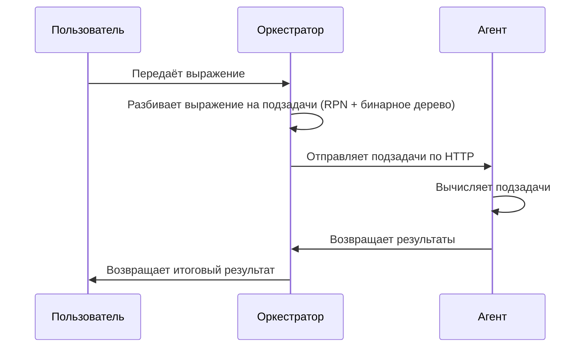

# Распределённый вычислитель арифметических выражений

Этот проект реализует веб-сервис, который принимает математические выражения через HTTP-запросы, вычисляет их (конкурентно) и возвращает результат. Сервис состоит из двух компонентов: **оркестратора** и **агента**. Оркестратор принимает выражения и разбивает их на подзадачи, которые затем отправляет агенту для вычисления.

---

## Содержание

1. [Требования](#требования)
2. [Запуск проекта](#запуск-проекта)
3. [Примеры использования](#примеры-использования)
   - [Отправка выражения](#отправка-выражения)
   - [Проверка статуса выражения](#проверка-статуса-выражения)
   - [Получение результата](#получение-результата)
4. [Ошибки](#ошибки)
5. [Тестирование](#тестирование)
6. [Архитектура системы](#архитектура-системы)

---

## Требования

- Установленный Go (версия 1.16 или выше).
- Установленный Git (для клонирования репозитория).

---

## Запуск проекта

### 1. Клонирование репозитория

```bash
git clone https://github.com/StepanShel/Yandexproject
```
```
cd Yandexproject
```

### 2. Запуск

Оркестратор принимает выражения и управляет агентами. Для удобства вы можете изменять время, за которое будут выполняться операции, так же вы можете изменять порт и количество паралелльно работающих агентов.
(если вы ничего не хотите менять, то применятся дефолтные значения)

```bash
export TIME_ADDITION_MS=300
export TIME_SUBTRACTION_MS=300
export TIME_MULTIPLICATION_MS=300
export TIME_DIVISION_MS=400
export PORT=8080
```

Команда для запуска:

```bash
(go run cmd/orchestrator/main.go & go run cmd/agent/main.go & trap 'kill %1 %2' SIGINT; wait)
```

Вы увидите сообщение:
```
Orchestrator is running on http://localhost:8081
```
Если вы хотите остановить работу сервера, нажмите ctrl+c

---

## Примеры использования

### 1. Вначале нужно зарегестрироваться:

```bash
curl -X POST http://localhost:8081/api/v1/register \
  -H "Content-Type: application/json" \
  -d '{"login":"your-login","password":"your-password"}'
```

### 2. Затем нужно залогиниться:

```bash
curl -X POST http://localhost:8081/api/v1/login \
  -H "Content-Type: application/json" \
  -d '{"login":"your-login","password":"your-password"}'
```
После вы получите свой JWT токен, который далее нужно использовать при запросах

### 3. Отправка выражения

Отправьте выражение на вычисление:

```bash
curl -X POST http://localhost:8081/api/v1/calculate \
  -H "Authorization: YOUR_JWT_TOKEN" \
  -H "Content-Type: application/json" \
  -d '{"expression":"2+2*2"}'
```

Ответ:
```json
{
  "id": "0948c874-da79-4418-b01c-09817ed1d569"
}
```

### 2. Проверка статуса выражения

Проверьте статус всех выражений:

```bash
curl -X GET http://localhost:8080/api/v1/expressions \
  -H "Authorization: Bearer YOUR_TOKEN"
```

Ответ:
```json
{
  "expressions": [
    {
      "id": "0948c874-da79-4418-b01c-09817ed1d569",
      "expression": "2*2+2",
      "status": "processing"
    }
  ]
}
```

### 3. Получение результата

Получите результат по ID выражения:

```bash
curl --location 'http://localhost:8081/api/v1/expressions/0948c874-da79-4418-b01c-09817ed1d569' \
   -H "Authorization: Bearer YOUR_TOKEN"
```

Ответ:
```json
{
  "id": "0948c874-da79-4418-b01c-09817ed1d569",
  "status": "DONE",
  "result": 6
}
```

---

## Ошибки

Ошибки могут возникать при некорректном выражении, например 2-(7+0)-+4. В таком случае статус выражения изменится на error. Так же при неправильно методе запроса:
#### Статус 405 (неверный метод)
```bash
curl --location 'http://localhost:8081/api/v1/calculate'
```

Ответ:
```json
{
    "error": "unsupported method"
}
```
Или при неверном id
#### Статус 404 (Выражение не найдено)

```bash
curl --location 'http://localhost:8081/api/v1/expressions/несуществующий-id'
```

Ответ:
```json
{
  "error": "Expression not found"
}
```

---

## Тесты

В проекте так же есть тесты для работы агента, оркестратора и парсера, находятся они в соответсвующих папках

---

## Архитектура системы

Ниже представлена схема работы системы:



### Схема работы системы

1. **Оркестратор**:
   - Принимает HTTP-запросы с выражениями.
   - Разбивает выражение на подзадачи.
   - Отправляет подзадачи агенту.
   - Сохраняет результаты вычислений.

2. **Агент**:
   - Получает подзадачи от оркестратора.
   - Вычисляет результат с учетом времени выполнения операций.
   - Отправляет результат обратно оркестратору.

### Схема взаимодействия

```
Клиент -> Оркестратор -> Агент -> Оркестратор -> Клиент
```
